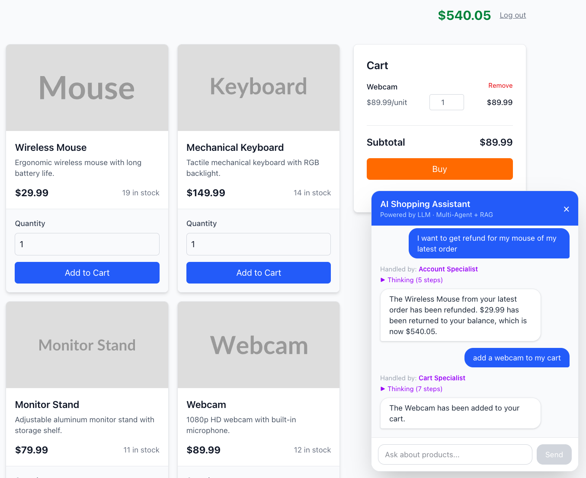
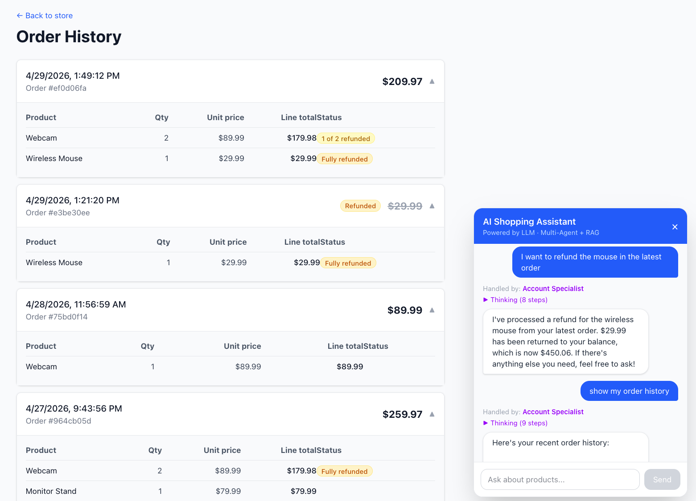
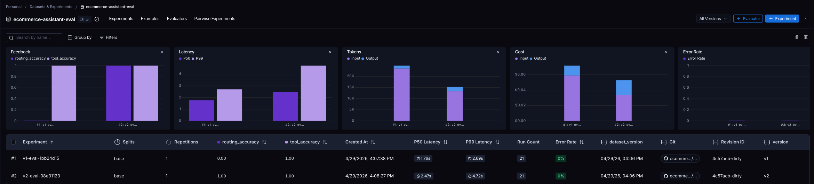

# E-commerce AI Assistant

A full-stack ecommerce demo with an agentic AI shopping assistant. Users can browse products, place orders, and chat with an AI that can search products, compare items, check balances, add items to the shopping cart, remove items from the shoppint cart, and process refunds — showing its reasoning step by step.





## Stack

| Layer | Tech |
|---|---|
| Frontend | Next.js 15, React 19, Tailwind CSS 4, TypeScript |
| Backend | FastAPI, SQLAlchemy 2, SQLite, Pydantic v2 |
| AI Agent | LangGraph (multi-agent), LangChain, LLM, ChromaDB (RAG) |
| Observability | LangSmith (tracing + evaluation) |
| Package managers | `npm` (frontend), `uv` (backend) |

---

## Architecture & Data Flow

```
┌─────────────────────────────────────────────────────────────────┐
│  Browser (Next.js)                                              │
│                                                                 │
│  ┌──────────────┐   ┌─────────────────┐   ┌────────────────┐    │
│  │  Store Page  │   │   CartContext   │   │   ChatWidget   │    │
│  │  (balance,   │◄──│  (client-side   │◄──│  (floating     │    │
│  │   products)  │   │   cart state)   │   │   chat panel)  │    │
│  └──────────────┘   └─────────────────┘   └───────┬────────┘    │
│                                               POST /v2/chat/    │
└───────────────────────────────────────────────────┼─────────────┘
                                                    │
                              ┌─────────────────────▼───────────────┐
                              │  FastAPI  (backend)                 │
                              │                                     │
                              │  POST /v1/chat  ← single-agent      │
                              │  POST /v2/chat  ← multi-agent       │
                              └─────────────────────┬───────────────┘
                                                    │
                              ┌─────────────────────▼───────────────┐
                              │  LangGraph Multi-Agent Graph        │
                              │                                     │
                              │  [Supervisor] ← structured output   │
                              │       │                             │
                              │   ┌───┴──────────────────┐          │
                              │   ▼       ▼      ▼       ▼          │
                              │ Product Account Cart  General       │
                              │ Agent   Agent   Agent  Agent        │
                              └──┬──────────┬───────────┬───────────┘
                                 │          │           │
                    ┌────────────▼──┐  ┌────▼────┐  ┌───▼─────────────┐
                    │  ChromaDB     │  │ SQLite  │  │  OpenAI API     │
                    │  (in-process) │  │  (DB)   │  │  (LLM +         │
                    │               │  │         │  │   embeddings)   │
                    │  vector index │  │ users   │  └─────────────────┘
                    │  of product   │  │ products│
                    │  descriptions │  │ orders  │
                    └───────────────┘  └─────────┘
```

### Request lifecycle

1. User types a message in `ChatWidget` → `POST /v2/chat/` with `{user_id, message, session_id}`
2. `backend/app/routers/chat_v2.py` calls `run_agent_v2(db, user_id, message, session_id)`
3. `run_agent_v2()` builds a LangGraph state graph and invokes it with the current message
4. LangGraph restores prior turns with `MemorySaver` using `thread_id=session_id`
5. The supervisor agent classifies the request and returns a route label: `product`, `account`, `cart`, or `general`
6. The selected specialist runs with only its relevant tools, calls tools as needed, and produces the final answer
7. The router returns `{response, steps, cart_actions, agent_name}`
8. `ChatWidget` renders the response, expands the "Thinking" accordion with routing/tool details, and applies any cart mutations

---

## AI Agent Capabilities

The default assistant is a **LangGraph multi-agent flow**. It uses a supervisor-router pattern: one supervisor classifies the user's intent, then delegates to a focused specialist agent. Each specialist is still a LangChain tool-calling agent, so once the request reaches a specialist, the model can call tools, read tool results, and continue until it has a final answer.

### How the agent decides what to do

The main chat path starts in `backend/app/routers/chat_v2.py`:

```python
# backend/app/routers/chat_v2.py
response_text, raw_steps, raw_cart, agent_name = run_agent_v2(
    db, payload.user_id, payload.message, payload.session_id
)
```

`run_agent_v2()` wraps the user message in graph state and invokes LangGraph. Only the current message is passed in directly; prior conversation turns are restored by the graph checkpointer using the session ID.

```python
# backend/app/agent/v2/agent.py
graph = build_graph(db, user_id, cart_actions)
config = {"configurable": {"thread_id": session_id}}

initial_state = {
    "messages": [HumanMessage(content=message)],
    "agent_name": "",
    "cart_actions": [],
    "steps": [],
}

final_state = graph.invoke(initial_state, config=config)
```

The graph is a simple supervisor → specialist workflow:

```python
# backend/app/agent/v2/graph.py
builder.add_node("supervisor_agent", make_supervisor_node(_llm))
builder.add_node("product_agent", make_product_node(_llm, db, user_id, cart_actions))
builder.add_node("account_agent", make_account_node(_llm, db, user_id, cart_actions))
builder.add_node("cart_agent", make_cart_node(_llm, db, user_id, cart_actions))
builder.add_node("general_agent", make_general_node(_llm))

builder.set_entry_point("supervisor_agent")

builder.add_conditional_edges(
    "supervisor_agent",
    lambda state: state["agent_name"],
    {
        "product": "product_agent",
        "account": "account_agent",
        "cart": "cart_agent",
        "general": "general_agent",
    },
)
```

The first argument to `add_conditional_edges()` is the source node: routing happens after `supervisor_agent` finishes. The lambda reads the latest graph state and returns a route label such as `"product"`. The mapping converts that route label into the destination node ID, so `"product": "product_agent"` means "when the supervisor returns the `product` route, run the `product_agent` node."

The supervisor uses structured output to classify intent. It does not call product/account/cart tools itself; it sets `agent_name`, and LangGraph uses that field to choose the next agent node.

```python
# backend/app/agent/v2/agents/supervisor.py
router_llm = llm.with_structured_output(SupervisorDecision)
decision = router_llm.invoke([SystemMessage(content=_SYSTEM)] + state["messages"])

return {
    "agent_name": decision.route,
    "steps": state["steps"] + [{
        "tool": "supervisor",
        "input": state["messages"][-1].content,
        "output": f"Routed to {decision.route}: {decision.reasoning}",
    }],
}
```

`ShoppingState` is the shared state object moving through the graph:

```python
# backend/app/agent/v2/state.py
class ShoppingState(TypedDict):
    messages: Annotated[list[BaseMessage], add_messages]
    agent_name: str
    cart_actions: list[dict]
    steps: list[dict]
```

- `messages` is the conversation stream. `add_messages` tells LangGraph to append new messages instead of replacing the list.
- `agent_name` is the supervisor's route label, such as `product` or `cart`.
- `steps` powers the frontend "Thinking" accordion.
- `cart_actions` is part of the state shape, while the actual cart mutations are collected through the `cart_actions` list captured by the tools.

Each specialist gets a filtered tool set. For example, the product agent only sees product-related tools:

```python
# backend/app/agent/v2/agents/product.py
all_tools = make_tools(db, user_id, cart_actions)
tool_names = {"search_products", "compare_products", "get_affordable_products"}
tools = [t for t in all_tools if t.name in tool_names]

agent = create_agent(llm, tools, system_prompt=_SYSTEM)
result = agent.invoke(state)
```

Inside a specialist, `create_agent` tells the LLM about those tools — their names, descriptions, and schemas. The LLM then runs the usual tool-calling loop:

```
┌─────────────────────────────────────────────────┐
│  Specialist LLM tool loop                       │
│                                                 │
│  1. Read: specialist prompt + graph messages    │
│  2. Decide: which tool, if any, to call next    │
│  3. Emit: AIMessage with tool_calls = [...]     │
│  4. LangChain executes the tool → ToolMessage   │
│  5. LLM reads the result, goes back to 2.       │
│  6. When done: emit AIMessage with no tool_calls│
└─────────────────────────────────────────────────┘
```

`POST /v1/chat/` still exists as a simpler single-agent path in `backend/app/agent/v1/agent.py`: it builds one LangChain agent with all tools and keeps history in the v1 router's `_history` dict. v2 is the main/default flow used by the frontend.

### How intermediate steps are extracted

After a specialist finishes, `extract_steps()` walks the message list to pair each tool call with its result. This is what powers the "Thinking" accordion in the UI, alongside the supervisor routing step:

```python
# backend/app/agent/shared/steps.py
tool_call_map: dict[str, dict] = {}

for msg in messages:
    if isinstance(msg, AIMessage) and msg.tool_calls:
        for tc in msg.tool_calls:
            # store what the model wanted to call
            tool_call_map[tc["id"]] = {"tool": tc["name"], "input": str(tc["args"])}
    elif isinstance(msg, ToolMessage):
        # match the result back to the call using the shared ID
        entry = tool_call_map.get(msg.tool_call_id, {})
        steps.append({
            "tool": entry.get("tool", "unknown"),
            "input": entry.get("input", ""),
            "output": str(msg.content),
        })
```

The final answer comes from `extract_last_response()` in `backend/app/agent/shared/response.py`, which returns the last `AIMessage` without tool calls.

### How tools are defined

Every tool is a plain Python function decorated with `@tool` inside `make_tools()`. The function's docstring is what LLM reads to decide when to call it:

```python
# tools.py — inside make_tools(db, user_id, cart_actions)
@tool
def search_products(query: str) -> str:
    """Search for products using natural language. Use this when the user asks for product
    recommendations, wants to find items matching a use-case, or asks what's available."""
    results = search_products_rag(query, n=4)
    ...
```

**What is a closure?**

Each tool is a **closure** — a function that "remembers" variables from its surrounding scope. In this case, when `make_tools(db, user_id, cart_actions)` is called, every tool inside it captures `db`, `user_id`, and `cart_actions` from that call's context:

```python
def make_tools(db, user_id, cart_actions):  # These 3 values are captured
    @tool
    def search_products(query: str) -> str:
        # search_products "remembers" db, user_id, and cart_actions from the parent scope
        # It can use them without them being passed as parameters
        results = search_products_rag(query, n=4)
        return ...
    
    @tool
    def add_to_cart(product_name: str, quantity: int = 1) -> str:
        # add_to_cart mutates cart_actions by appending a cart action
        product = db.query(Product).filter(...).first()
        cart_actions.append({"action": "add", "product_id": str(product.id), ...})
        return ...
    
    @tool
    def get_user_balance(_: str = "") -> str:
        user = get_user_by_id(db, uid)  # db is available here too
        return f"Your balance is ${user.balance:.2f}"
    
    return [search_products, add_to_cart, get_user_balance, ...]  # Tools are returned with db/uid/cart_actions baked in
```

**Why closures matter here:**
- LLM calls tools with just their parameters (e.g., `search_products(query="webcam")`)
- But tools also need access to `db` (to query the database), `user_id` (to check the user's balance), and `cart_actions` (to record items being added/removed)
- Instead of passing these through LLM's JSON (which would be messy), we bundle them into the tool itself as a closure
- Result: clean tool signatures from LLM's perspective, but full database access and cart mutation capability under the hood

The docstring is the tool's contract with the model. Changing it changes when and how LLM chooses to use the tool.

### How RAG works

**RAG (Retrieval-Augmented Generation)** is the technique that powers the `search_products` tool. Instead of asking LLM to recall product details from training data (which it doesn't have), we:

1. Store product knowledge in a **vector database** (ChromaDB) at startup
2. At query time, retrieve the most relevant products by **semantic similarity**
3. Pass those results to LLM as context so it can answer accurately

#### What is an embedding?

An embedding is a list of numbers (a vector) that represents the *meaning* of a piece of text. Texts with similar meanings produce vectors that are close together in space — even if they use different words:

```
"great for video calls"   → [0.21, -0.43, 0.87, ...]
"1080p webcam microphone" → [0.19, -0.41, 0.85, ...]  ← nearby → high similarity
"mechanical keyboard RGB" → [-0.62, 0.31, -0.14, ...] ← far away → low similarity
```

This is why a user asking *"what's good for video calls?"* finds the Webcam — the query and the product description land near each other in vector space, even though neither mentions "webcam" in the query.

#### Phase 1 — Indexing (startup)

When the backend starts, `embed_products()` in `rag.py` is called once:

```python
# main.py — runs on startup after seed_database()
products = db.query(ProductModel).all()
embed_products(products)
```

```python
# rag.py — embed_products()
collection.upsert(
    ids=[str(p.id) for p in products],                        # UUID as the unique key
    documents=[f"{p.name}. {p.description}" for p in products],  # text sent to OpenAI to embed
    metadatas=[{"name": p.name, "price": p.price, ...} for p in products],  # returned at query time
)
```

For each product, ChromaDB calls OpenAI's `text-embedding-3-small` model to convert the product text into a 1536-dimension vector, then stores it alongside the metadata. The result looks like:

```
ChromaDB collection "products":
┌──────────────────────────────────────────────────────────────────────┐
│ id           │ document (text)                    │ vector           │
│──────────────│────────────────────────────────────│──────────────────│
│ "abc-001"    │ "Webcam. 1080p HD webcam with      │ [0.21, -0.43...] │
│              │  built-in microphone."             │                  │
│ "abc-002"    │ "Apple AirTag. Small Bluetooth     │ [0.09, 0.77...]  │
│              │  tracker, Apple Find My network."  │                  │
│ "abc-003"    │ "Tile Mate. Bluetooth item         │ [0.11, 0.74...]  │
│              │  tracker, Tile community network." │                  │
│ ...          │ ...                                │ ...              │
└──────────────────────────────────────────────────────────────────────┘
```

#### Phase 2 — Querying (per search)

When the agent calls `search_products("item tracker")`:

```python
# rag.py — search_products_rag()
results = collection.query(query_texts=["item tracker"], n_results=4)
```

ChromaDB embeds the query using the same OpenAI model, then finds the 4 stored vectors closest to the query vector by **cosine similarity**. AirTag and Tile Mate rank highest because their descriptions mention Bluetooth trackers and finding lost items. The function returns their metadata (name, price, product_id) for the agent to use.

```
Query: "item tracker"
       ↓ embed
  [0.10, 0.76, ...]
       ↓ cosine similarity against all stored vectors
  Apple AirTag  → 0.94 ✓ top match
  Tile Mate     → 0.91 ✓ top match
  Webcam        → 0.12 ✗ not relevant
  Laptop        → 0.08 ✗ not relevant
```

#### What gets stored in ChromaDB vs what comes from the DB

Not all product fields belong in ChromaDB metadata. The rule is: **only store static data in ChromaDB**. Dynamic data must always be read live from the DB.

| Field | Where it lives | Why |
|---|---|---|
| `name` | ChromaDB metadata | Never changes |
| `description` | ChromaDB document (embedded) | Never changes |
| `price` | ChromaDB metadata | Static in this demo |
| `product_id` | ChromaDB metadata | UUID key for DB lookup |
| `stock_quantity` | **DB only** | Changes on every order and refund |

`stock_quantity` is intentionally excluded from ChromaDB. After `search_products_rag()` returns its matches, the `search_products` tool does a live DB lookup to get current stock for those products:

```python
# tools.py — search_products tool
results = search_products_rag(query, n=4)
product_ids = [r["product_id"] for r in results]
live_stock = {
    str(p.id): p.stock_quantity
    for p in db.query(Product).filter(Product.id.in_(product_ids)).all()
}
```

This ensures the agent never tells a user "5 in stock" when inventory has since been depleted by other orders.

#### Why not just use SQL LIKE?

| | SQL `LIKE '%webcam%'` | RAG (vector search) |
|---|---|---|
| "webcam" | ✓ finds Webcam | ✓ finds Webcam |
| "video calls" | ✗ no match | ✓ finds Webcam |
| "item tracker" | ✗ no match | ✓ finds AirTag & Tile Mate |
| "something for my home office" | ✗ no match | ✓ finds relevant products |

SQL requires the exact word to appear in the text. RAG understands intent and synonyms — it matches by meaning, not by string.

#### ChromaDB runs in-process

ChromaDB is embedded directly in the FastAPI process — no separate server to start. The collection is created in memory on startup:

```python
# rag.py — _get_collection() (singleton)
client = chromadb.Client()  # in-memory, no external server
embedding_model = os.getenv("EMBEDDING_MODEL", "text-embedding-3-small")
ef = OpenAIEmbeddingFunction(model_name=embedding_model)
_collection = client.get_or_create_collection(name="products", embedding_function=ef)
```

The embedding model is configurable via the `EMBEDDING_MODEL` environment variable (defaults to `text-embedding-3-small`).

Because it's in-memory, the index is rebuilt every time the server restarts — which is fine for a demo with 8 products. For production with thousands of products, you'd use `chromadb.PersistentClient(path="./chroma_data")` to store vectors on disk.

---

### Tools

| Tool | What it does |
|---|---|
| `search_products` | Semantic search over product descriptions via ChromaDB (RAG). Finds products by use-case, not just exact name. |
| `compare_products` | Side-by-side price / stock / description comparison of two products. |
| `get_user_balance` | Reads the user's current account balance from the DB. |
| `get_affordable_products` | Filters all in-stock products to those the user can afford with their current balance. |
| `get_order_history` | Lists the user's 5 most recent orders (newest first) with each item's name, quantity, price, and per-item refund status. |
| `process_item_refund` | Refunds a single item from an order by order ID prefix and product name. Validates eligibility (30-day window, item not already refunded), then atomically restores balance + stock. |
| `add_to_cart` | Fuzzy-matches a product name, checks stock, and pushes a cart action back to the frontend so the cart sidebar updates in real time. |
| `remove_from_cart` | Fuzzy-matches a product name and pushes a remove action to the frontend, clearing the item from the cart sidebar instantly. |

### Sample interactions

#### 1. Product Search & Recommendation
Finds products by use-case using semantic search (RAG), not just keyword matching.

| You say | Agent does | You see |
|---|---|---|
| "What's good for video calls?" | `search_products("video calls")` | Top matching products ranked by semantic similarity |
| "Do you have anything for a home office?" | `search_products("home office")` | Relevant products across categories |

#### 2. Product Comparison
Compares two products side by side on price, stock, and description.

| You say | Agent does | You see |
|---|---|---|
| "Compare the laptop and the webcam" | `compare_products("laptop", "webcam")` | Side-by-side price, stock, and description |
| "What's the difference between the keyboard and the mouse?" | `compare_products("keyboard", "mouse")` | Structured comparison of both items |
| "AirTag vs Tile Mate — which should I get?" | `search_products("item tracker")` → `compare_products("AirTag", "Tile Mate")` | Price, stock, ecosystem compatibility, and description comparison |

#### 3. Balance & Affordability Check
Reads the user's live balance and filters the catalog to what they can buy right now.

| You say | Agent does | You see |
|---|---|---|
| "What's my balance?" | `get_user_balance()` | "Your current balance is $670.03." |
| "What can I afford right now?" | `get_affordable_products()` | In-stock products priced ≤ your balance, highest-price first |

#### 4. Add & Remove from Cart via Chat
Finds the product, checks stock, and updates the cart sidebar in real time — no page interaction needed.

| You say | Agent does | You see |
|---|---|---|
| "Add 2 webcams to my cart" | `search_products("webcam")` → `add_to_cart("Webcam", 2)` | Cart sidebar updates instantly with 2 webcams |
| "Put a keyboard in my cart" | `search_products("keyboard")` → `add_to_cart("Keyboard", 1)` | Item appears in cart immediately |
| "Remove the webcam from my cart" | `remove_from_cart("Webcam")` | Webcam removed from cart sidebar instantly |
| "I don't want the keyboard anymore" | `remove_from_cart("Keyboard")` | Keyboard cleared from cart immediately |

#### 5. Refund Processing
Multi-step: looks up order history, checks eligibility (30-day window, not already refunded), then executes the refund atomically — restoring balance and stock.

| You say | Agent does | You see |
|---|---|---|
| "I want a refund on order 536f7bce" | `process_refund("536f7bce")` | Balance restored, order marked Refunded in Order History |
| "Refund my most recent order" | `get_order_history()` → `process_refund("<id>")` | Agent finds the ID itself, then refunds |

Multi-step walkthrough — "Refund my most recent order":
1. Agent calls `get_order_history()` to retrieve the latest order ID
2. Reads the refund eligibility status from the tool output
3. Calls `process_refund("<id>")` to execute the refund
4. Reports the refunded amount and new balance

---

## Session ID & Conversation History

### How the session ID is created and persisted

`ChatWidget` generates a session ID using the browser's built-in `crypto.randomUUID()` — no library required. It produces a version 4 UUID like `f47ac10b-58cc-4372-a567-0e02b2c3d479`. On first visit, it saves the ID to browser storage for persistence across page reloads:

```ts
// frontend/src/components/ChatWidget.tsx
const sessionId = useRef(
  localStorage.getItem("chat_session_id") ?? (() => {
    const id = crypto.randomUUID();
    localStorage.setItem("chat_session_id", id);
    return id;
  })()
);
```

### Where it's stored on the client

The ID is stored in **`localStorage`** (browser's persistent key-value store under the key `"chat_session_id"`). It persists across:
- Page refreshes (F5, Cmd+R)
- Closing and reopening the browser
- Navigating away and back
- Closing the chat bubble and reopening it

You can see it in action via Chrome DevTools → **Application** tab → **Local Storage** → find `chat_session_id`. You'll also see it in the Network tab's request payload.

### What happens on browser refresh and server restart

| Event | session_id | Conversation history |
|---|---|---|
| Re-render (state change) | unchanged | preserved |
| Close/reopen chat bubble | unchanged | preserved |
| Open new tab/window | new UUID | starts fresh |
| **Browser refresh (F5)** | **same** (reads from localStorage) | **preserved if backend process is still running** |
| **Close browser, reopen** | **same** (localStorage persists) | **preserved if backend process is still running** |
| **Clear browser data** | **new UUID** (localStorage wiped) | starts fresh |
| **Server restart** | **same** (client still has old ID) | **wiped** (`MemorySaver` is in-memory) |

### Server restart behavior (current implementation)

The v2 chat flow uses LangGraph's in-memory `MemorySaver` checkpointer, so restarting the server clears all saved graph state, including conversation messages. However, the client still holds onto its stored `session_id`. On the next message:

1. Client sends message with old `session_id`
2. LangGraph finds no saved state for that `thread_id`
3. Conversation appears to restart, but the client ID is unchanged

This is expected behavior for in-memory storage. The user won't notice unless they look at the Network tab.

### How to clear the session ID

To start a completely fresh conversation (new `session_id`), clear the browser's localStorage:

**Via Chrome DevTools:**
- **Application** tab → **Local Storage** → right-click → **Clear** → reload page

**Via browser settings:**
- Settings → Privacy → Clear browsing data → select "Cookies and other site data" → Clear

**Programmatically (for developers):**
```ts
localStorage.removeItem("chat_session_id");
window.location.reload();
```

### Future: persisting conversation history in production

For production, to survive server restarts, replace `MemorySaver` with durable storage. The cleanest option is a persistent LangGraph checkpointer backed by a database. Another option is to store serialized conversation state yourself in Redis or PostgreSQL:

```python
# Option A: Redis (fast, session-focused)
import redis
r = redis.Redis()
history_json = r.get(f"chat_session:{session_id}")
r.set(f"chat_session:{session_id}", json.dumps(messages), ex=86400)  # 24h TTL

# Option B: PostgreSQL (permanent, queryable)
class ChatSession(Base):
    __tablename__ = "chat_sessions"
    session_id: Mapped[str] = mapped_column(primary_key=True)
    messages: Mapped[str] = mapped_column(Text)  # JSON list
    created_at: Mapped[datetime]
    
    # Retrieve: session = db.query(ChatSession).filter_by(session_id=sid).first()
```

With persistent storage, the conversation survives even if the server crashes and restarts.

### How v2 graph state is maintained

The default `/v2/chat/` flow uses LangGraph state plus `MemorySaver`, keyed by the browser `session_id`. It does not keep a manual `_history` dict:

```python
# backend/app/agent/v2/agent.py
config = {"configurable": {"thread_id": session_id}}
```

Each request passes an `initial_state`, but fields do not all behave the same way. LangGraph applies this input as an update to the saved graph state for that thread:

```python
# backend/app/agent/v2/agent.py
initial_state = {
    "messages": [HumanMessage(content=message)],
    "agent_name": "",
    "cart_actions": [],
    "steps": [],
}
```

`ShoppingState` defines which fields merge and which fields reset:

```python
# backend/app/agent/v2/state.py
class ShoppingState(TypedDict):
    messages: Annotated[list[BaseMessage], add_messages]
    agent_name: str
    cart_actions: list[dict]
    steps: list[dict]
```

```
POST /v2/chat/
{ message, session_id }
        │
        ▼
run_agent_v2()
creates request-scoped cart_actions = []
        │
        ▼
graph.invoke(initial_state, thread_id=session_id)
        │
        ▼
MemorySaver restores saved graph state for this thread_id
        │
        ├─ messages      prior saved messages
        ├─ agent_name    previous route label
        ├─ steps         previous turn trace
        └─ cart_actions  previous graph-state value
        │
        ▼
LangGraph applies initial_state as an update
        │
        ├─ messages      merged via add_messages
        │                old messages + new HumanMessage
        │
        ├─ agent_name    reset to ""
        │
        ├─ steps         reset to []
        │
        └─ cart_actions  reset to [] in graph state
        │
        ▼
supervisor_agent runs
        │
        ├─ sets agent_name to product/account/cart/general
        └─ appends supervisor routing step
        │
        ▼
specialist agent runs
        │
        ├─ adds AI/tool messages to messages
        ├─ returns state["steps"] + extracted tool steps
        └─ tools may append frontend cart updates to request-scoped cart_actions
        │
        ▼
MemorySaver checkpoints final graph state
        │
        ├─ messages      carried into next turn
        ├─ agent_name    saved, but reset next request
        ├─ steps         saved, but reset next request
        └─ cart_actions  saved, but reset next request
        │
        ▼
chat_v2.py returns
{ response, steps, cart_actions, agent_name }
```

What carries useful state across turns?

| Field | Carries useful state across turns? | Why |
|---|---:|---|
| `messages` | Yes | Uses `add_messages`, so each new turn is merged with prior conversation messages. |
| `agent_name` | No | Reset to `""` on each request and recalculated by the supervisor. |
| `steps` | No | Reset to `[]` on each request so the Thinking accordion shows only the current turn. |
| `cart_actions` | No | Graph-state field resets; actual frontend cart actions are captured in the request-scoped list closed over by tools. |

So the main state that carries conversation context across turns is `messages`. The other fields are per-request outputs used to route the graph, render the Thinking accordion, or update the frontend cart.

`POST /v1/chat/` is different: `backend/app/routers/chat_v1.py` keeps `_history: dict[str, list[BaseMessage]]`, manually appends `HumanMessage` and `AIMessage`, and caps history to the last 20 messages. v1 is kept as a simpler single-agent comparison path; v2 is the main frontend flow.

**Trade-off:** v2 currently uses in-process `MemorySaver`, which is simple and fast for a demo, but it resets if the server restarts. A production version would use a durable LangGraph checkpointer or database-backed state store so conversation state survives process restarts and can be shared across server instances.

---

## API Endpoints

| Method | Path | Description |
|---|---|---|
| GET | `/users/` | List all users |
| GET | `/users/{id}` | Get user by UUID |
| GET | `/products/` | List all products |
| GET | `/products/{id}` | Get product by UUID |
| POST | `/orders/` | Place an order |
| GET | `/orders/?user_id={id}` | List orders for a user |
| POST | `/orders/{id}/refund?user_id={uid}` | Refund an order |
| POST | `/v1/chat/` | Send a message to the single-agent (LangChain ReAct) |
| POST | `/v2/chat/` | Send a message to the multi-agent (LangGraph, default) |

Interactive docs available at `http://localhost:8000/docs`.

---

## Getting Started

### Backend

```bash
cd backend
cp .env.example .env        # replace placeholder values with your own
uv sync --extra dev
uv run uvicorn app.main:app --reload
```

**Environment variables** (in `.env`):
| Variable | Required | Default | Notes |
|----------|----------|---------|-------|
| `OPENAI_API_KEY` | Yes | — | Get from https://platform.openai.com/api-keys |
| `LLM_MODEL` | No | `gpt-4o` | Change to swap LLM models (e.g., `gpt-4-turbo`, `gpt-4o-mini`) |
| `EMBEDDING_MODEL` | No | `text-embedding-3-small` | Used by ChromaDB for vector embeddings |
| `LANGSMITH_API_KEY` | No | — | Get from https://smith.langchain.com — enables tracing + eval |
| `LANGSMITH_PROJECT` | No | — | LangSmith project name (e.g. `ecommerce-ai-assistant`) |
| `LANGCHAIN_TRACING_V2` | No | — | Set to `true` to enable LangSmith tracing |

API runs at `http://localhost:8000`. On first startup, the database is seeded with 3 users and 8 products (including Apple AirTag and Tile Mate for item-tracker comparison demos), and products are embedded into ChromaDB for semantic search.

### Frontend

```bash
cd frontend
npm install
npm run dev
```

App runs at `http://localhost:3000`.

---

## LangSmith Integration

This project uses [LangSmith](https://smith.langchain.com) for two things: **automatic tracing** of every AI interaction, and **offline evaluation** of routing and tool accuracy across both the v1 and v2 agents.

### Setup

Add these three variables to `backend/.env`:

```env
LANGSMITH_API_KEY=lsv2_...          # from https://smith.langchain.com → Settings → API Keys
LANGSMITH_PROJECT=ecommerce-ai-assistant
LANGCHAIN_TRACING_V2=true
```

No code changes needed — LangChain/LangGraph picks up `LANGCHAIN_TRACING_V2=true` automatically and sends every graph invocation to LangSmith.

### Automatic Tracing

Once the env vars are set, every chat request to `/v2/chat/` is traced automatically:

1. Start the backend: `uv run uvicorn app.main:app --reload`
2. Send a message in the UI
3. Go to **LangSmith → Projects → ecommerce-ai-assistant**
4. Click any trace to see:
   - The full LangGraph execution (Supervisor → Specialist node → END)
   - The supervisor's routing decision and reasoning
   - Every tool call with inputs and outputs
   - Token usage and latency per node

### Evaluation

The eval suite runs 21 test queries through v1 and v2 and measures:

| Evaluator | What it measures |
|---|---|
| `routing_accuracy` | Did the supervisor route to the correct specialist (product / account / cart / general)? |
| `tool_accuracy` | Did the specialist call the expected tool first? |

#### Step 1 — Push the dataset to LangSmith (one-time)

```bash
cd backend
uv run python -m evals.dataset
```

This creates the `ecommerce-assistant-eval` dataset in your LangSmith account with 21 input/expected-output pairs.

#### Step 2 — Run the evals

```bash
# Baseline: single-agent (LangChain ReAct)
uv run python -m evals.run_eval --version v1

# Multi-agent (LangGraph)
uv run python -m evals.run_eval --version v2
```

Each run automatically resets the database first (clears orders, restores balances and stock to seed values) so results are reproducible regardless of prior state.

#### Step 3 — View results in LangSmith

1. Go to **LangSmith → Datasets & Testing → ecommerce-assistant-eval**
2. Click the **Experiments** tab — you'll see `v1-eval-*` and `v2-eval-*` runs
3. Click **Compare** (select both runs) to see a side-by-side metric table:
   - `routing_accuracy`: fraction of queries routed to the correct specialist
   - `tool_accuracy`: fraction of queries where the correct tool was called first
4. Click any individual example row to see the full trace for that query

#### Cost & Latency Tracking

LangSmith automatically tracks **cost** and **latency** for every eval query:

**Where the message enters the graph:**

When a user sends "take the laptop out of my cart", here's the flow:
1. **HTTP endpoint** (`backend/app/routers/chat_v2.py:11-17`): `POST /v2/chat/` receives the message
2. **Agent wrapper** (`backend/app/agent/v2/agent.py:21-28`): Message is wrapped in a `HumanMessage` and passed to the LangGraph
3. **Graph invocation** (`backend/app/agent/v2/agent.py:28`): `graph.invoke(initial_state, config=config)` is where the message **enters the LangGraph** and starts flowing through the supervisor → specialist pipeline

**Cost Calculation:**
- LangSmith monitors all OpenAI API calls made during each query: supervisor LLM classification, specialist LLM tool execution, and embedding calls
- For each call, it captures token counts: `input_tokens` and `output_tokens`
- Cost formula: `(input_tokens × input_price_per_1k) + (output_tokens × output_price_per_1k)`
- **Pricing source**: OpenAI's official pricing (e.g., GPT-4o: $5/1M input tokens, $15/1M output tokens as of 2024). Prices are configured in your LangSmith account settings → **Pricing** tab. You can update them if OpenAI's pricing changes, or customize for different models/providers.
- **Total cost per run**: sum of costs across all 21 eval queries
- **Example**: a query routing to product specialist might call: supervisor (1.5k input, 50 output) + search_products (300 input, 200 output) + embeddings (50 input, 0 output). LangSmith sums all three.

**Latency Measurement:**
- Latency is measured end-to-end: from `graph.invoke()` (agent.py) through the supervisor routing step and specialist execution, until the final response is produced
- Breakdown by node:
  - **Supervisor latency**: time to classify intent + call LLM to decide routing (e.g., "this is a cart query → route to cart specialist")
  - **Specialist latency**: time for the routed agent to call tools (search_products, add_to_cart, etc.) and generate response
  - **Total latency**: supervisor + specialist + graph scheduling overhead
- **Where to see it**: In the LangSmith experiment results table, the **Latency** column shows milliseconds (e.g., `5.37s`), and you can drill into each query to see the breakdown by node

**Performance observations (v1 vs v2):**

| Metric | v1 (Single-Agent) | v2 (Multi-Agent) | Why the difference? |
|---|---|---|---|
| **Latency** | Lower | Higher | v2 adds supervisor routing overhead (extra LLM call to classify intent). Expected trade-off: supervisor classifies quickly but adds latency vs v1's direct tool-calling |
| **Total tokens** | Baseline | Fewer input tokens, similar/more output tokens | v2's supervisor+specialist pipeline is more token-efficient. The supervisor precisely routes to the right specialist, avoiding v1's exploratory tool calls (e.g., v1 might call search_products unnecessarily to "think"). Result: fewer redundant tokens, cleaner conversations. |
| **Cost** | Baseline | Lower overall | Fewer input tokens + same model (GPT-4o) = lower cost per query. The supervisor's 1-step routing beats v1's multi-step reasoning in terms of token efficiency. |

This is **expected behavior**: v2 trades a bit of latency (one extra supervisor LLM call) for better accuracy (correct specialist routed first) and lower cost (fewer wasted token calls exploring wrong tools). For the 21 eval queries, v2 is more efficient despite the supervisor overhead.



#### Dataset categories

| Category | Count | Expected agent |
|---|---|---|
| Product Search | 7 | product |
| Product Compare | 2 | product |
| Account / Balance | 4 | account |
| Budget Shopping | 2 | product |
| Refunds | 2 | account |
| Cart Management | 1 | cart |
| General / Chitchat | 3 | general |
| **Total** | **21** | |

---

## User Flow

1. Select your account on the login page
2. Browse products and add them to your cart
3. Review your cart in the sidebar and click **Buy** to place an order
4. View past orders via **Order History**
5. Open the **AI Shopping Assistant** (bottom-right bubble) to search, compare, add to cart, or request refunds via natural language

---

## User Authentication

### How user login works

The app uses a simple, demo-style login with no password:

1. **Login page** (`/`): Shows a list of seeded users
2. User clicks their card → `setCurrentUser({ id, name })` saves to `localStorage["current_user"]` as JSON
3. Page redirects to `/store` using `router.replace("/")` (not `push`, so the back button doesn't re-enter login)
4. **Protected pages** check `getCurrentUser()` on mount → if null, redirect back to `/`

### How it survives browser refresh

User login is stored in **`localStorage`** under the key `"current_user"`:

```ts
// frontend/src/lib/auth.ts
export function getCurrentUser(): CurrentUser | null {
  if (typeof window === "undefined") return null;  // SSR guard
  const raw = localStorage.getItem("current_user");
  if (!raw) return null;
  return JSON.parse(raw) as { id: string; name: string };
}

export function setCurrentUser(user: CurrentUser): void {
  localStorage.setItem("current_user", JSON.stringify(user));
}
```

On refresh:
1. React mounts the page
2. `useEffect` calls `getCurrentUser()` → reads from localStorage
3. If found, user stays logged in
4. If null, redirects to `/` (login page)

This means:
- **Page refresh**: User stays logged in ✓
- **Close browser, reopen**: User stays logged in ✓
- **Open new tab**: User stays logged in ✓ (shared localStorage)
- **Clear browser data**: User logged out (localStorage wiped)

### How to log out

Call `clearCurrentUser()` to remove the localStorage entry:

```ts
function handleLogout() {
  clearCurrentUser();
  router.replace("/");
}
```

Or manually clear via Chrome DevTools → **Application** → **Local Storage** → delete `current_user` key.

### Implementation details

**Frontend (no auth library):**
- User login is plain React `useState` + `localStorage`
- `getCurrentUser()` includes an SSR guard (`typeof window === "undefined"`)
- `useEffect` checks login status on mount and redirects if needed
- No logout button on the store page (login is ephemeral for this demo)

**Backend:**
- Trusts the `user_id` sent in every request
- No session validation or tokens
- Not production-safe (intended for demo only)

### Key differences from persistent auth

This project intentionally uses a **localStorage-based approach**:
- Simple and straightforward for a demo
- Session survives page refreshes
- Can be cleared with browser data
- No complex session management or logout flows

For production, use JWT tokens, session cookies, or OAuth with a secure backend session store.

---

## Running Tests & Checks

### All checks at once (recommended)

```bash
# From project root, run both linting and tests
bash run-checks.sh

# Lint only
bash run-checks.sh --lint

# Test only
bash run-checks.sh --test
```

The `run-checks.sh` script:
- Validates required tools (`uv`, `npm`, `python3`) are installed
- Runs backend linting (Python with ruff)
- Runs frontend linting (TypeScript + ESLint)
- Runs all backend tests
- Provides clear feedback with emoji status indicators
- Exits on first failure to catch issues early

### Backend tests

```bash
cd backend

# Run all tests with verbose output
uv run pytest tests/ -v

# Run a specific test file
uv run pytest tests/test_chat.py -v

# Run a specific test function
uv run pytest tests/test_chat.py::test_chat_returns_response -v

# Run with coverage report
uv run pytest tests/ --cov=app --cov-report=html
```

30 tests covering users, products, orders (including refunds), and chat routing. Tests use a separate SQLite database (`test.db`) and mock external dependencies.

## Linting & Formatting

### Backend (Python)

```bash
cd backend

# Check for issues (doesn't modify files)
uv run ruff check .

# Auto-fix issues
uv run ruff check . --fix

# Format code (organize imports, fix whitespace)
uv run ruff format .

# Run all three in sequence
uv run ruff check . --fix && uv run ruff format .
```

[Ruff](https://docs.astral.sh/ruff/) is a fast Python linter and formatter. It checks style, imports, and common errors.

### Frontend (TypeScript + JavaScript)

```bash
cd frontend

# Run TypeScript type checking + ESLint
npm run check

# Run ESLint only
npm run lint

# Auto-fix ESLint issues
npm run lint -- --fix
```

`npm run check` combines:
- TypeScript type checking (catches type errors before runtime)
- ESLint (code quality, style, common mistakes)

---

## Project Structure

```
ecommerce-ai-assistant/
├── backend/
│   ├── app/
│   │   ├── agent/
│   │   │   ├── shared/      # rag.py (ChromaDB), tools.py (8 tools) — shared by v1 + v2
│   │   │   ├── v1/          # agent.py: run_agent_v1() — single LangChain ReAct agent
│   │   │   └── v2/          # LangGraph multi-agent: state.py, graph.py, agent.py
│   │   │       └── agents/  # supervisor, product, account, cart, general nodes
│   │   ├── db/              # Base model (UUID PK, timestamps), session, idempotent seed
│   │   ├── models/          # User, Product, Order, OrderItem (SQLAlchemy ORM)
│   │   ├── schemas/         # Pydantic schemas incl. ChatRequest/ChatResponse/CartAction
│   │   ├── routers/         # orders.py, products.py, users.py, chat_v1.py, chat_v2.py
│   │   └── main.py          # lifespan: create_all → seed → embed; registers /v1 and /v2
│   ├── evals/               # LangSmith eval: dataset.py, evaluators.py, run_eval.py
│   └── tests/               # pytest, FastAPI TestClient, dependency_overrides for test DB
└── frontend/
    └── src/
        ├── app/             # Next.js pages: /, /store, /order-history, /dashboard
        ├── components/      # ProductCard, CartSidebar, OrderHistory, ChatWidget
        ├── contexts/        # CartContext — addItem/removeItem/total, used by ChatWidget
        ├── lib/             # auth.ts: getCurrentUser/setCurrentUser with SSR guard
        └── styles/
```

---

## Troubleshooting

**Port 8000 already in use**
```bash
lsof -ti :8000 | xargs kill
```

**Chat returns 500 errors**
- Ensure `OPENAI_API_KEY` is set in `backend/.env`
- Restart the backend if products aren't appearing in search (ChromaDB re-embeds on startup)

**Conversation history resets unexpectedly**
- History is in-memory — it clears on server restart. This is expected for a demo.

---

## Adding New Models

All models inherit from `Base` in `app/db/base.py`:

```python
from app.db.base import Base
from sqlalchemy import String
from sqlalchemy.orm import Mapped, mapped_column

class MyModel(Base):
    __tablename__ = "my_models"
    name: Mapped[str] = mapped_column(String(255), nullable=False)
    # id, created_at, updated_at provided automatically
```
